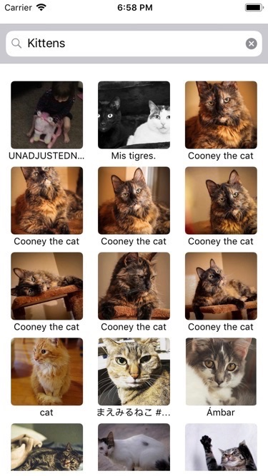

# Image Search (Flickr)

Image search app would search for images using the Flickr API
This application can be extended to replace the search functionality with any other API implementation (custom or third-party). The modification to business logic and the search services can be easily done by implementing/replacing the interactor and service components. 
The default working application fetches the Flickr images.
## Features
* Search text
* Infinite paginated scroll
* Pull to refresh



# Table of Contents
1. [`Installation`](#installation)
1. [`Prerequisites`](#prerequisites)
1. [`Usage`](#usage)
1. [`Structure`](#structure)
1. [`Customization`](#customization)
1. [`TestCases`](#testcases)
1. [`Notes`](#notes)
1. [`Authors`](#authors)
1. [`License`](#license)


## `Installation`

Open the workspace in XCode, and run the application either on simulator or on device.
Make sure you open the XCode workspace and not project as the project has dependencies on CocoaPod libraries.
Follow CocoaPod guidelines.

## `Prerequsites`
* XCode 10
* iOS 10 + 

## `Dependencies`
* Alamofire for network api calls.
* AlamofireImage image lazy load.
* SwiftJSON for response json models.
* ReactiveSwift for sending model update notifications to the view.


## `Structure`

Folder Structure


The application structure and components are modeled based on clean architecture principles.
The components are customized and optimized according to the current application need.
Below image will givee you the glimpse of component inteer-communication.


## `Usage`
The application exposes below components
* ImageData – view model
* ImagePresenter – component for populating the view model
* ImageSearchInteractor – component for communicating with network service and presenter components
* ImageSearchService – component to interact with models and network api 

## `Customization`

These components can be extended for custom implementation and the dependencies needs to be injected in the app.
Call setDependencies method with custom implementations of presenter, interactor, service in viewcontroller
```swift
setDependencies(presenter, interactor, service)
```
else modify the method if you need to get rid of default Flickr Image functionality
The default functionality is set to search Flickr Images.
Add custom test cases if you extend or modify the functionality.

## `TestCases`
Currently the test cases are written for FlickrSearch functionality assuming that the APIs are always available. 
The current test code coverage is 97.3% and the project will keep on test cases if unhandled cases are found
Only unit test cases are covered that also programmatically checks the basic and necessary UI behaviour with assumptions.
UITest cases are not included yet and are planned for future releases. 
But the current test cases cover most of the functionality.

## `Notes`

*   Autoresizing mask is used here for simplicity, but ideally to make the layout more resilient Autolayout constraints must be provided which is planned for future releases
* 	The proper activity indicator should be shown, for now default UIActivityIndicator is used.
* 	Customization of the view, xib for reusability is considered for future releases. This will make ImageSearchController more generic.
* 	Test cases could be changed to stubbed network call.
* 	Routing is not in scope but can be implemented in future releases.
* 	View Model can be optimized and segregated further.
*   The application is in development phase and is not tested on any devices.

## `Author`

Shweta Pande

## `License`

This project is licensed under the MIT License.